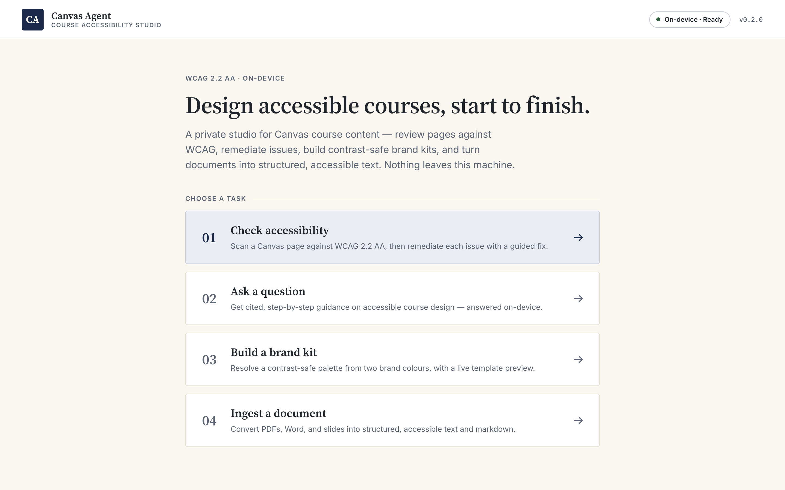
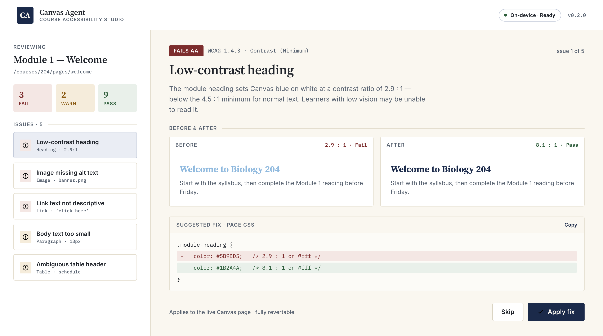
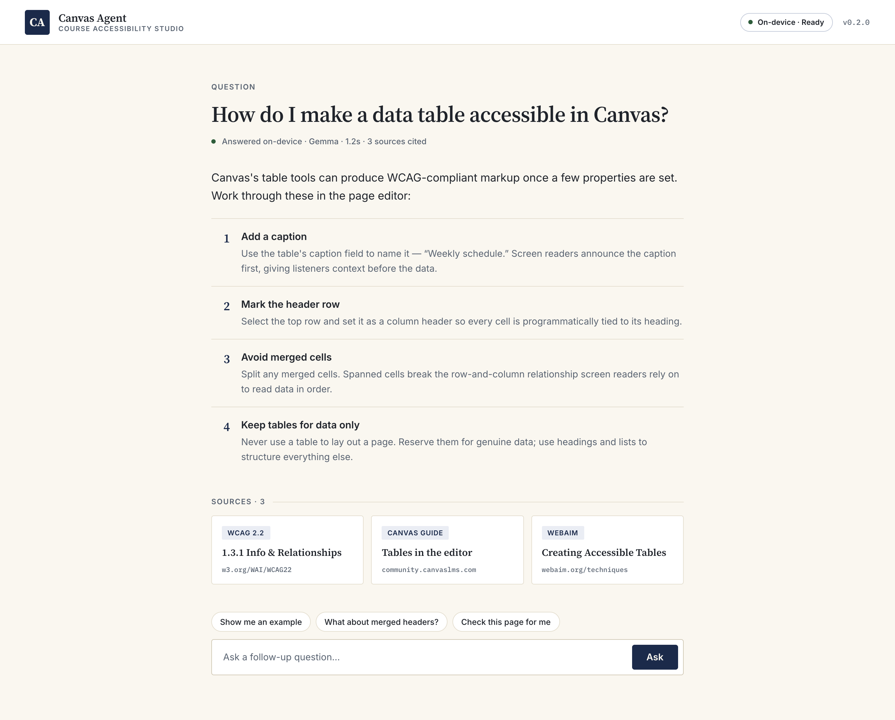
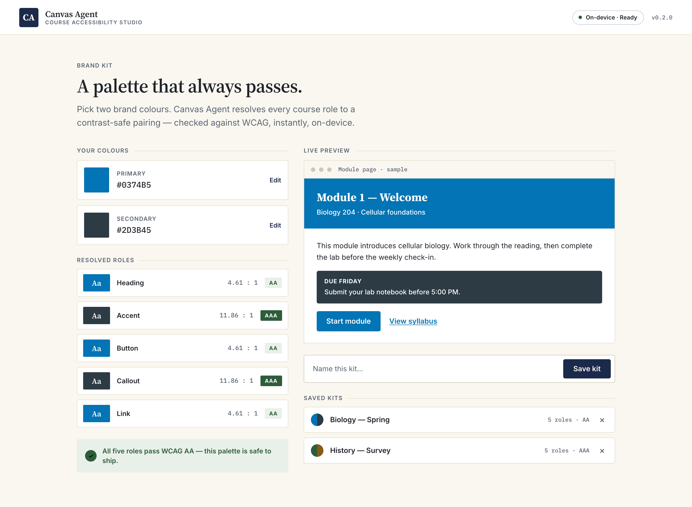
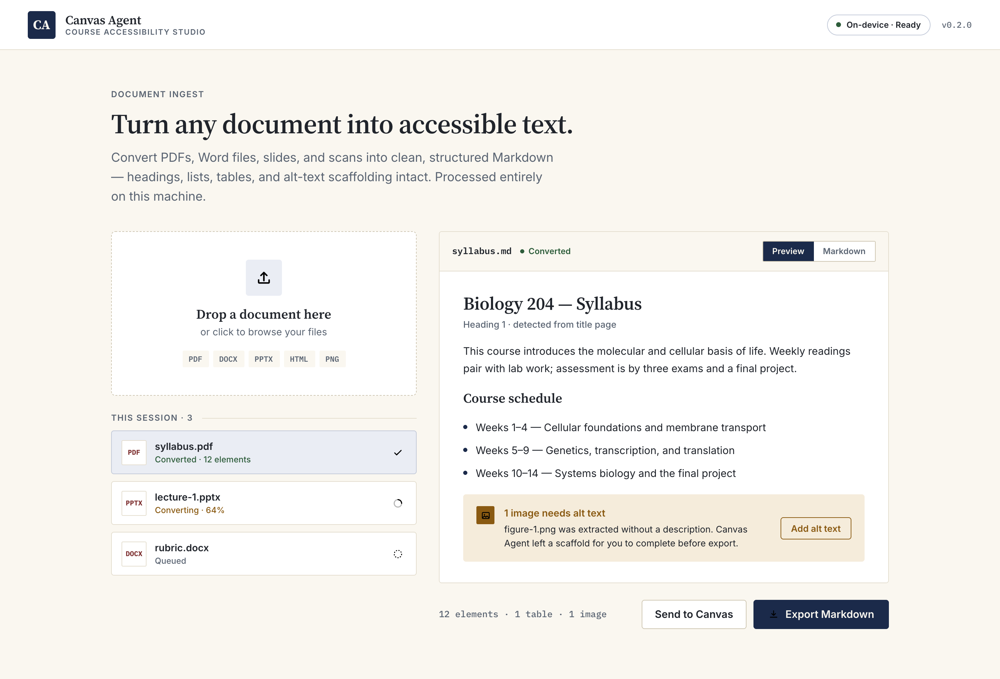

# Canvas Agent

**Canvas Course Design & Accessibility Assistant** — an on-device macOS app that
helps instructors build and remediate [Canvas LMS](https://www.instructure.com/canvas)
content that meets **WCAG 2.2 Level AA**.

Everything runs locally. There is no cloud service and no third-party API call:
the language model and the document-ingestion pipeline both run on your machine
as bundled sidecars, so course content and credentials never leave the device.

## What it does

The app opens to a single question — *"What are you doing today?"* — and asks only
the next required question for the job you pick:

- **Build a Canvas page** — generate an accessible page from a guided template and
  get checked HTML (every fragment carries an authoritative accessibility badge).
- **Fix an existing page** — paste HTML or import a read-only Canvas page, then get
  WCAG findings and remediations.
- **Ask how Canvas works** — a Q&A mode, with or without a screenshot.

Accessibility checking is backed by [axe-core](https://github.com/dequelabs/axe-core)
plus the app's own HTML allowlist/sanitizer engine; document import (DOCX/PPTX/
XLSX/PDF/images → structured content) runs through a local
[Docling](https://github.com/docling-project/docling) sidecar.

## Screens

A bookish, higher-ed visual language — Source Serif headings, a calm paper
ground, and a contrast-safe palette throughout.

### Home

The app opens to a single prompt and four tasks.



### Check accessibility & remediate

Findings grouped by pass/warn/fail, each with a before/after preview and a
guided, revertable fix.



### Ask a question

Cited, step-by-step guidance on accessible course design — answered on-device.



### Build a brand kit

Resolve a contrast-safe palette from two brand colours, with a live template
preview.



### Ingest a document

Convert PDFs, Word, and slides into structured, accessible text and markdown.



## Requirements

- **macOS** on **Apple Silicon (arm64)**
- **Node.js ≥ 20** (for building from source)

The packaged app bundles its own runtimes (a local LLM via
[Ollama](https://ollama.com), Docling, and a Chromium build for accessibility
checks), so end users do not install anything else.

## Quick start (from source)

```bash
npm install
npm run build      # tsc + copy assets
npm run app        # build, then launch the Electron app
```

Other useful scripts:

```bash
npm run typecheck  # tsc --noEmit
npm test           # unit + e2e suite (node:test via tsx)
npm run verify     # typecheck + tests
npm run audit:prod # production-dependency vulnerability audit
```

## Building a release

Producing the signed, notarized `.app` / `.dmg` requires an Apple Developer ID and
notarization credentials, plus locally staged sidecar binaries:

```bash
npm run stage:browsers   # stage the Chromium build
npm run stage:sidecars   # stage the Ollama + Docling sidecars
npm run package          # build → pre-release checks → electron-builder → DMG
```

`pre-release.mjs --strict` fails closed if Apple notarization credentials are
absent. See [`docs/RELEASING.md`](docs/RELEASING.md) for the full procedure.

## Project layout

Source lives under `src/`, organized by concern; each module has its own README:

| Module | Responsibility |
|---|---|
| `app/` | Electron main + renderer (the desktop UI) |
| `engine/` | HTML allowlist/sanitizer + accessible-HTML rendering |
| `ingest/` | Document ingestion via the Docling sidecar |
| `llm/` | Local LLM lifecycle + client (Ollama sidecar) |
| `orchestrator/` | Tool definitions + the build/remediate gate |
| `knowledge/` | On-device knowledge packs (templates, rubrics, WCAG basics) |
| `canvas/`, `storage/`, `templates/`, `theme/`, `runtime/`, `contracts/` | Canvas integration, persistence, theming, and runtime wiring |

## Privacy & security posture

- **On-device only** — no network calls to model or document APIs.
- Model-supplied file references are contained to the uploads directory
  (`src/ingest/safe-path.ts`); URL ingestion is guarded against SSRF
  (`src/ingest/safe-url.ts`).
- Generated HTML is rendered only inside a sandboxed, script-disabled iframe under
  a strict Content-Security-Policy.

## License

Licensed under the **Apache License, Version 2.0** — see [`LICENSE`](LICENSE).

Bundled and dependency components retain their own licenses; see
[`THIRD-PARTY-NOTICES.md`](THIRD-PARTY-NOTICES.md). Note that bundled model
weights (e.g. Gemma) are governed by their respective model licenses, which are
**not** Apache-2.0.

---

© 2026 JohnnyRobot AI
